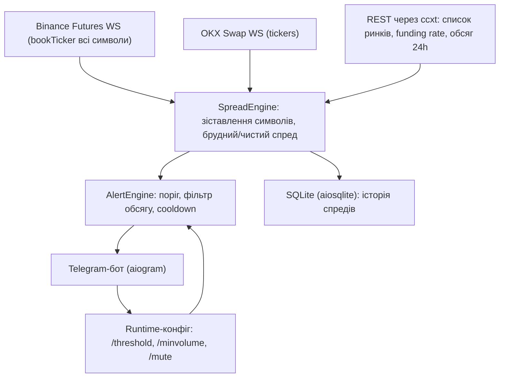

# Арбітражний монітор Binance–OKX (перпетуали)

> Живий документ: коригуємо в міру розвитку проєкту.
> Репозиторій: `git@github.com:eugene-enterprify/TrueArbitrage.git`

## Мета

Фоновий сервіс на Python для Windows-ПК: відстежує різницю котирувань між USDT-перпетуалами Binance Futures і OKX Swap по всіх спільних парах, надсилає Telegram-сповіщення, коли чистий спред (з комісіями та фандингом) перевищує поріг. Стратегія: long на дешевій біржі + short на дорогій, вихід при сходженні котирувань.

## Ключові параметри (за замовчуванням, змінюються через бота)

- Поріг спреду: 2.0% (брудний), у сповіщенні також чистий спред
- Фільтр ліквідності: `min(обсяг_24h_Binance, обсяг_24h_OKX) >= $20M` — пари нижче порогу не потрапляють у сповіщення, але пишуться в базу з позначкою
- Комісії: тейкер 0.05% на кожну з 4 угод (вхід/вихід на обох ногах), налаштовується
- Антиспам: сповіщення при перетині порогу вгору + cooldown 15 хв на пару + повідомлення про закриття спреду

## Архітектура

## Структура проєкту

- `main.py` — запуск, asyncio-оркестрація всіх компонентів
- `src/exchanges/base.py` — інтерфейс `ExchangeAdapter` (розрахований на майбутні 10+ бірж)
- `src/exchanges/binance.py` — WS-стрім `!bookTicker` (усі символи одним з'єднанням), REST для funding/обсягів
- `src/exchanges/okx.py` — WS канал `tickers` (батч-підписка на всі SWAP-інструменти)
- `src/spread_engine.py` — зіставлення символів (`BTCUSDT` ↔ `BTC-USDT-SWAP`), розрахунок: брудний спред `(bid_дорожча − ask_дешевша)/ask_дешевша`, чистий = брудний − 4×комісія, ± фандинг
- `src/alert_engine.py` — поріг, фільтр ліквідності, cooldown, події «спред відкрився/закрився»
- `src/telegram_bot.py` — aiogram: сповіщення + команди
- `src/storage.py` — SQLite: таблиця `spreads` (час, пара, біржа long/short, брудний %, чистий %, funding обох ніг, обсяги, позначка ліквідності); експорт у CSV
- `src/config.py` + `config.yaml` — дефолти; `.env` — токен бота (у `.gitignore`)
- `requirements.txt`, `README.md`
- `PLAN.md` — цей план

## Git-репозиторій

Код зберігається на GitHub: `git@github.com:eugene-enterprify/TrueArbitrage.git`. На першому етапі: `git init`, підключення remote, `.gitignore` (обов'язково `.env`, `*.db`, `venv/`, `__pycache__/`), перший коміт із планом і каркасом, push у `main`. Далі — коміт після кожного завершеного етапу.

## Технології

Python 3.11+, `websockets` (нативні стріми — швидше для bulk-котирувань), `ccxt` (метадані ринків, funding, обсяги — і готовий шлях до 10+ бірж), `aiogram`, `aiosqlite`, `pydantic` для конфігу.

## Команди Telegram-бота

- `/start` — реєстрація чату (автовизначення chat ID)
- `/status` — стан з'єднань, кількість пар, топ поточних спредів
- `/threshold 2.5` — поріг спреду у %
- `/minvolume 20` — мінімальний обсяг 24h у млн $
- `/top` — топ-10 поточних спредів (з тих, що проходять фільтр)
- `/mute BTC` / `/unmute BTC` — вимкнути сповіщення по парі
- `/export` — вивантажити історію спредів як CSV-файл прямо в чат

## Формат сповіщення

Пара, брудний і чистий спред, ціни ask/bid і funding rate по кожній нозі, обсяги 24h обох бірж, напрямок фандингу (працює на вас / проти вас). Окреме повідомлення, коли спред закрився (з тривалістю життя спреду).

## Надійність даних (обов'язково, без цього сигнали недостовірні)

- **Захист від застарілих котирувань**: кожна котирування зберігається з часом отримання; якщо будь-яка нога старша за ~10 секунд — пара тимчасово виключається з розрахунку спреду (інакше «мовчазне» з'єднання дає хибні спреди). WebSocket-з'єднання мають автоматичний reconnect з exponential backoff (Binance примусово розриває з'єднання раз на 24 год — це штатна ситуація).
- **Множники в назвах символів**: на Binance дешеві монети торгуються з префіксом (`1000PEPEUSDT` = ціна за 1000 монет), на OKX та сама монета — `PEPE-USDT-SWAP` за 1 шт. Зіставлення символів нормалізує множник (1000x, 10000x), інакше ці пари або загубляться, або дадуть спред у сотні відсотків.
- **Health-сповіщення**: бот повідомляє про втрату і відновлення з'єднання з біржею; `/status` показує вік останнього оновлення даних по кожній біржі.
- **Обсяг OKX**: приходить у контрактах/монетах — конвертується в USDT перед порівнянням з порогом $20M.

## Етапи реалізації

- [x] 0. Git: ініціалізація репозиторію, remote на GitHub, збереження `PLAN.md` у проєкті, перший коміт і push
- [x] 1. Каркас проєкту: venv, залежності, конфіг, `.env` з токеном, `.gitignore`
- [x] 2. Адаптери бірж: WS-підключення з reconnect, зіставлення спільних пар з нормалізацією множників (1000x), кеш bid/ask з часовими мітками; періодичне (раз на ~5 хв) REST-оновлення funding rates і обсягів 24h (OKX — конвертація в USDT)
- [x] 3. SpreadEngine + SQLite: розрахунок спредів по всіх парах з фільтром застарілих котирувань, запис в історію (семплінг: запис при зміні спреду понад 0.1% або раз на хвилину, щоб база не розпухала)
- [x] 4. Telegram-бот: сповіщення з антиспамом, усі команди, health-повідомлення про втрату/відновлення з'єднань, runtime-зміна налаштувань без перезапуску
- [x] 5. Чистий спред: комісії + фандинг у розрахунку і в тексті сповіщення
- [ ] 6. Запуск і перевірка на живих даних: звірити 2–3 пари вручну з сайтами бірж, тимчасово знизити поріг до 0.3–0.5% щоб побачити живі сповіщення, перевірити `/export` — **монітор працює, чекає /start від користувача в Telegram**

## Виявлено під час запуску (виправлено)

- `aiodns` на Windows ламає DNS-резолвінг aiohttp — видалено з середовища, застереження в `requirements.txt`
- Однакові тикери — різні монети: ON на Binance ($0.086) і ON на OKX ($95) — це різні активи. Додано авто-виключення пари, якщо ціни ніг різняться понад 2x (ON, ANTHROPIC, BB, OPENAI). Далі можна зробити мапінг вручну.

## На майбутнє (закладено в архітектуру, не реалізуємо зараз)

Нові біржі — новий файл-адаптер за інтерфейсом `ExchangeAdapter`; калькулятор розміру позиції `/calc`; автоторгівля; веб-дашборд.
